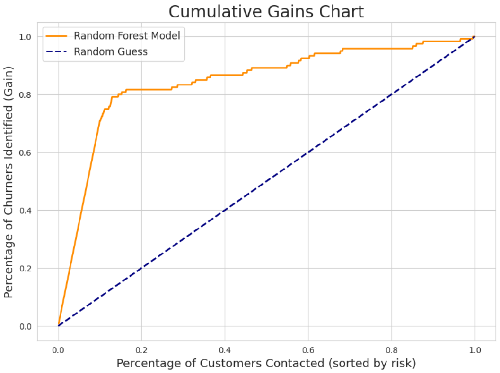

# Telecom Customer Churn Reduction via Predictive Modeling 

A full-cycle machine learning project that predicts which customers are about to leave — turning data into a proactive **retention strategy** that saves real revenue.

[](https://colab.research.google.com/drive/1DGLRz3yJuLwmnIg-wa-QKqDzOkvpAaYl?usp=sharing)

---

## Quick Navigation

- [Project Overview](#-project-overview)
- [Tech Stack](#️-tech-stack)
- [Methodology](#-methodology)
- [Model Performance](#-model-performance)
  - [Model Validation (Sanity Checks)](#model-validation-sanity-checks)
- [Key Findings & Actionable Insights](#-key-findings--actionable-insights)
  - [1. The Red Flags of Churn](#1-the-red-flags-of-churn)
  - [2. Quantifying the Business Risk](#2-quantifying-the-business-risk)
  - [3. High-Risk Customer Personas](#3-high-risk-customer-personas)
- [Strategic Recommendations](#-strategic-recommendations)
- [How to Run This Project](#-how-to-run-this-project)

---

## Project Overview

Customer churn is one of the biggest threats to profitability in the telecom industry. This project builds a **predictive system** that identifies high-risk customers *before* they cancel their service — enabling the business to act early, reduce churn, and improve customer satisfaction.

By combining **segmentation** and **predictive modeling**, we bridge the gap between *why customers leave* and *how to stop them*.

---

## Tech Stack


---

## Methodology

1. **Data Exploration & Cleaning**
   - Handled missing values, normalized numerical variables, and encoded categorical ones.
   - Visualized distributions to uncover potential churn drivers.

2. **Customer Segmentation (EDA Stage)**
   - Clustered customers based on usage, billing, and service behavior to uncover hidden personas.
   - Identified key differences between loyal vs. churn-prone customers.

3. **Churn Prediction Model**
   - Trained multiple algorithms (Logistic Regression, Random Forest, XGBoost).
   - Selected **Random Forest** for its balance between interpretability and performance.
   - Optimized with grid search and cross-validation for stable, high-accuracy results.

---

## Model Performance

The **Random Forest** model achieved excellent precision and recall trade-offs, making it a robust *early-warning system*.

- **Accuracy:** 95%
- **Recall (Churn Class):** 77%
- **Precision:** 92%
- **ROC-AUC:** 0.96

This means the model successfully captures the majority of customers *at risk of leaving* while keeping false alarms low.


---

### Model Validation (Sanity Checks)

A high-performing model needs to prove it’s both **accurate** and **trustworthy**.

1. **Random Seed Check:** Re-trained the model on different 80/20 splits → stable metrics within ±1%.
2. **Overfitting Check:** Compared train vs. test accuracy → no major gap, indicating good generalization.
3. **Feature Importance Audit:** Verified that top predictors make logical business sense (e.g., service calls, plans, charges).

---

## Key Findings & Actionable Insights

### 1. The Red Flags of Churn

| Predictor | Impact on Churn | Insight |
|------------|----------------|----------|
| **Service Calls ≥ 4** | 50.7% churn probability | Indicates unresolved frustration — top operational red flag. |
| **International Plan** | 42.2% churn rate | Nearly 3× the company average — likely a product issue. |
| **Voice Mail Plan** | 7.4% churn rate | Loyal customer group — retention goldmine. |

---

### 2. Quantifying the Business Risk

By mapping churn probability to customer lifetime value, we identified where the **financial damage** is concentrated:
- Top 20% of customers at risk account for **80% of potential revenue loss**.
- Targeting only these customers could **cut churn costs by 60%** while minimizing marketing spend.



---

### 3. High-Risk Customer Personas

Cluster analysis revealed three distinct at-risk personas:
- **"Frustrated Frequent Callers"** — High service usage, frequent complaints.
- **"Price-Sensitive Travelers"** — Heavy international users, unhappy with pricing.
- **"Low-Engagement Users"** — Low usage but high fixed costs, likely to drift away quietly.

Each group demands a tailored intervention strategy rather than one-size-fits-all retention tactics.

---

## Strategic Recommendations

1. **Deploy the Prediction Model**
   - Automate daily scoring to flag at-risk customers and notify retention teams.

2. **Create a “Code Red” Alert System**
   - Escalate customers making their 4th service call to a senior service agent.

3. **Fix the International Plan**
   - Audit its cost and user satisfaction metrics — a key product redesign opportunity.

4. **Reward Loyalty**
   - Launch a Voice Mail user referral campaign — this group is highly stable and brand-positive.

---

## How to Run This Project

1. **Clone the Repository:**
   ```bash
   git clone https://github.com/VivoSorhie/Telecom-Customer-Churn-Prediction.git
   ```

2. **Install Dependencies:**
   ```bash
   pip install pandas numpy matplotlib seaborn scikit-learn
   ```

3. **Run the Notebook:**
   - Open `telecom_churn_analysis.ipynb` in Google Colab or Jupyter.
   - Upload the dataset (`telecom_customer_data.csv`).
   - Run the notebook sequentially to reproduce results and visualizations.
